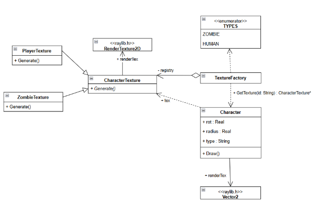
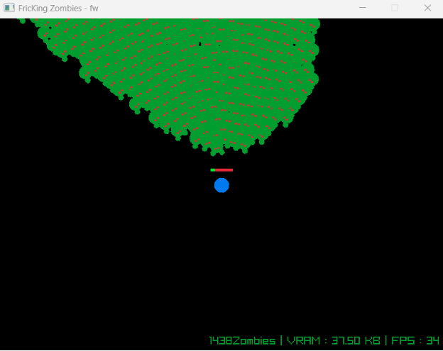
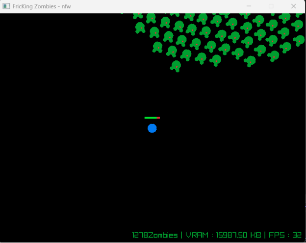

# Fricking Zombiessss

## Задача(Flyweight): Использовать приспособленец для отображения зомби в игре, где вы убегаете от орды зомби, которые постоянно появляются.

### **Решение:** Для отображения такого большого количества зомби, вместо отрисовки текстуры для каждого зомби, мы можем поместить в каждый класс ключ-ссылку (перечисление TYPES), указывающий на соответствующую текстуру в типе данных (map<TYPES, CharacterTexture\*>), которая представляет собой flyweights factory.



Рисунок 1: Упрощенная диаграмма классов метода c применением приспособлецa.

Ниже приведён краткий фрагмент кода, демонстрирующий описанный выше подход. 

```cpp
enum TYPES {

     ZOMBIE,

     HUMAN

};

class CharacterTexture {

public:

     RenderTexture2D renderTex;

     CharacterTexture() { renderTex = LoadRenderTexture(40, 40); }

     virtual ~CharacterTexture() { UnloadRenderTexture(renderTex); }

     virtual void Generate() = 0;

};

class ZombieTexture : public CharacterTexture {

public:

     ZombieTexture() : CharacterTexture() { Generate(); }

     void Generate() override {//...}

};

class PlayerTexture : public CharacterTexture {

public:

     PlayerTexture() { Generate(); }

     void Generate() override {//...}

};
```

В данном случае Texture и его дочерние элементы являются объектами класса Flyweight, а TextureFactory — это Flyweight factory.

```cpp
class TextureFactory {

     unordered\_map<TYPES, CharacterTexture\*> registry;

public:

     CharacterTexture\* GetTexture(TYPES pt) {

         if (registry.find(pt) == registry.end()) {

             switch (pt) {

             case TYPES::HUMAN: registry[pt] = new PlayerTexture(); break;

             case TYPES::ZOMBIE: registry[pt] = new ZombieTexture(); break;

             }

         }

         return registry[pt];

     }

     ~TextureFactory() {

         for (auto& pair : registry) delete pair.second;

     }

};
```

Все персонажи в игре получат текстуры из фабрики

```cpp
TextureFactory factory;

class Character {

public:

     Vector2 pos;

     float rot = 0;

     float radius = 10.0f;

     TYPES type;

     Character(Vector2 p, TYPES tp) : pos(p), type(tp) {}

     void Draw() {

         Rectangle src = { 0, 0, (float)factory.GetTexture(type)->renderTex.texture.width, (float)-factory.GetTexture(type)->renderTex.texture.height };

         Rectangle dest = { pos.x, pos.y, (float)factory.GetTexture(type)->renderTex.texture.width, (float)factory.GetTexture(type)->renderTex.texture.height };

         Vector2 origin = { (float)factory.GetTexture(type)->renderTex.texture.width / 2, (float)factory.GetTexture(type)->renderTex.texture.height / 2 };

         DrawTexturePro(factory.GetTexture(type)->renderTex.texture, src, dest, origin, rot, WHITE);

     }

};

class Player : public Character {//...}

class Zombie : public Character {//...}

Этот фрагмент кода используется для оценки производительности.

         int fps = GetFPS();

         float vramUsed = (textureCount \* (textureSize \* textureSize \* 4 \* 2)) / 1024.0f;
```

Как показано на рисунке 2, даже если будет создано тысяча зомби, будет использовано всего 37,5 КБ оперативной памяти.



Рисунок 2: Игра c Flyweights.

### Без использования Flyweights класс Character и наследующие его классы будут напрямую отвечать за отрисовку текстур при каждом создании нового объекта. (LoadRenderTexture)

```cpp
class Character {

public:

     Vector2 pos;

     float rot = 0;

     float radius;

     RenderTexture2D renderTex;

     Character() : pos({ 0, 0 }), radius(0) {

         renderTex.id = 0;

     }

     Character(Vector2 p, int size) : pos(p), radius(size / 2.0f) {

         renderTex = LoadRenderTexture(size, size);

     }

//...

     virtual void Generate(int size, Color color) = 0;

     void Draw() {

         if (renderTex.id == 0) return; 

         Rectangle src = { 0, 0, (float)renderTex.texture.width, (float)-renderTex.texture.height };

         Rectangle dest = { pos.x, pos.y, (float)renderTex.texture.width, (float)renderTex.texture.height };

         Vector2 origin = { (float)renderTex.texture.width / 2.0f, (float)renderTex.texture.height / 2.0f };

         DrawTexturePro(renderTex.texture, src, dest, origin, rot, WHITE);

     }

};

class Player : public Character {

public:

     //...

     void Generate(int size, Color color) override {

         if (renderTex.id == 0) return; // Safety check

         BeginTextureMode(renderTex);

         ClearBackground(BLANK);

         float c = size / 2.0f;

         DrawCircle(c, c, 12, color);            // Body

         EndTextureMode();

     }

     //...

};

class Zombie : public Character {

     Character\* target;

public:

     Zombie() : Character(), target(nullptr) {}

     Zombie(Vector2 p, int size, Color color, Character\* targetObj)

         : Character(p, size), target(targetObj) {

         Generate(size, color);

     }

     void Generate(int size, Color color) override {

         if (renderTex.id == 0) return;

         BeginTextureMode(renderTex);

         ClearBackground(BLANK);

         float c = size / 2.0f;

         DrawCircle(c + 12, c - 8, 5, color); // Hands

         DrawCircle(c + 12, c + 8, 5, color);

         DrawCircle(c, c, 12, color);         // Body

         DrawCircle(c + 4, c - 3, 2, RED);    // Eyes

         EndTextureMode();

     }

};
```

Естественно, объем оперативной памяти увеличится во много раз из-за большого количества форм. Количество зомби примерно на 200 меньше, чем раньше, но они занимают целых 16 МБ. 

Рисунок 3: Игра без Flyweights.

Использование шаблона Flyweight минимизирует накладные расходы на память за счет совместного использования внутренних данных тысячами экземпляров. Централизация свойств тайлов в TextureFactory позволяет избежать избыточного выделения памяти, обеспечивая высокую производительность и поиск по постоянному времени независимо от размера карты. 

### Сравнение: с моделью наилегчайшего веса и без нее

| Особенность | Без наилегчайшего веса (традиционный) | С наилегчайшим весом (Ваш код) |
| :--- | :--- | :--- |
| **Хранилище текстур** | Каждый экземпляр имеет свой собственный RenderTexture2D. | Экземпляры имеют общий указатель на одну «CharacterTexture». |
| **Потребление видеопамяти** | **Высокая.** Масштабируется линейно ($N$ зомби = $N$ текстур). | **Минимальный.** Постоянно (1 текстура каждого типа). |
| **Производительность появления** | **Медленно.** Необходимо выделять память графического процессора и рисовать текстуру при каждом появлении. | **Мгновенно.** Просто поиск по карте и назначение указателя. |
| **Размер объекта (ОЗУ)** | **Heavy.** Объект содержит полную структуру текстуры. | **Light.** Объект содержит только 64-битный указатель. |

Ссылка на проект: <https://github.com/solovozer/-2>


