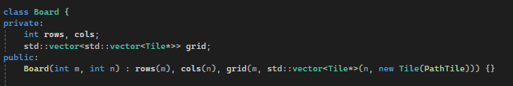
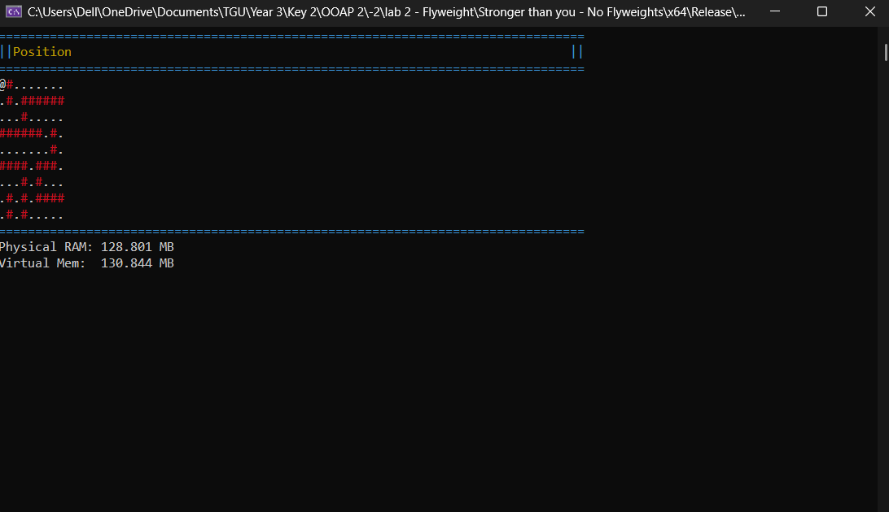
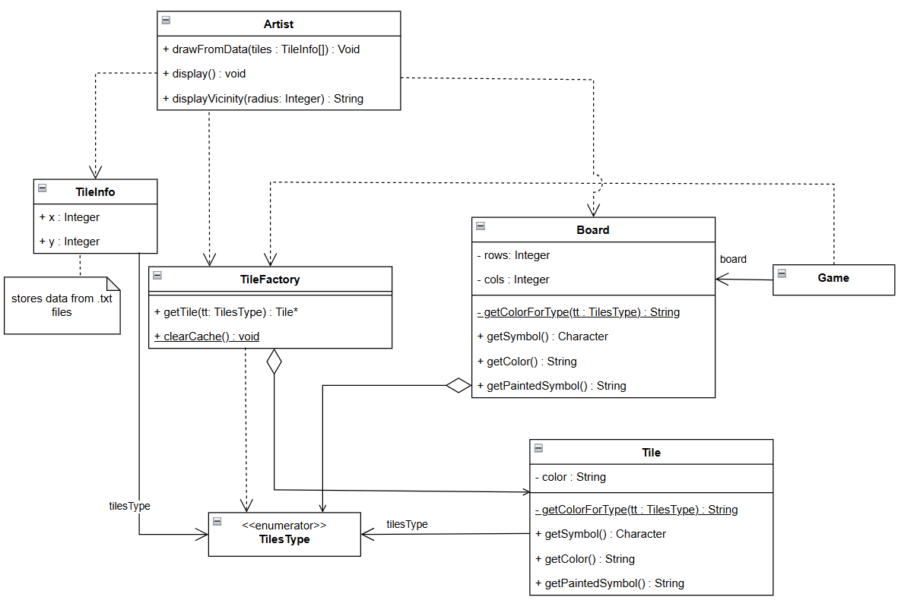
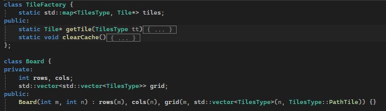
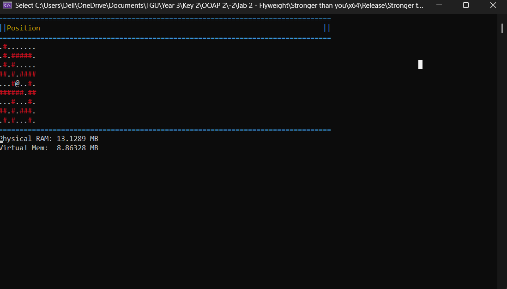

### Stronger than you

## __Задача__(Flyweight):
        Использовать приспособленец для создания игры-лабиринта, где каждая плитка представлена классом Tile со своим собственным символом и цветом. Вывести лабиринт на консоль

## __Решение__:
        В лабиринте будет храниться значение перечисления с именем __TilesType__ (с коротким целочисленным типом данных) (приспособленец), указывающее на соответствующую информацию класса __Tile__. __TileFactory__ (фабрика) будет отвечать за связь __TilesType__ с информацией в классе Tile.

На рисунке 1 показан код, который не использует приспособленец. Лабиринт (класс Board) должeн создавать объекты напрямую.

На рисунке 2 показанa oценка производительности данного сегмента кода при размере лабиринта 2000x2000.

При использовании приспособленцa, доска классов хранит только индекс карты (ключ), а карта возвращает указатель на соответствующий объект Tile. На рисунке 3 представлена упрощенная схема классов с элементами, созданными с использованием приспособленцa.

На рисунке 4 показан пример реализации кода, представленная на диаграмме на рисунке 3.
  

На рисунке 5 показана оценка игрового процесса и производительности приспособленцa. Как видно, при размере лабиринта 2000x2000 размер программы в оперативной памяти в 10 раз меньше.  
  

## __Заключение__:
    Использование шаблона Flyweight в игре-лабиринте минимизирует накладные расходы на память за счет совместного использования внутренних данных TileType тысячами экземпляров. Централизация свойств тайлов в TileFactory позволяет избежать избыточного выделения памяти, обеспечивая высокую производительность и поиск по постоянному времени независимо от размера карты. 

# Ссылка на проект: 
    https://github.com/solovozer/-2
