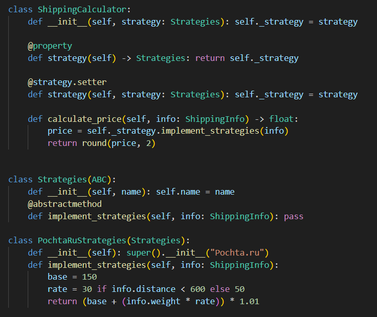
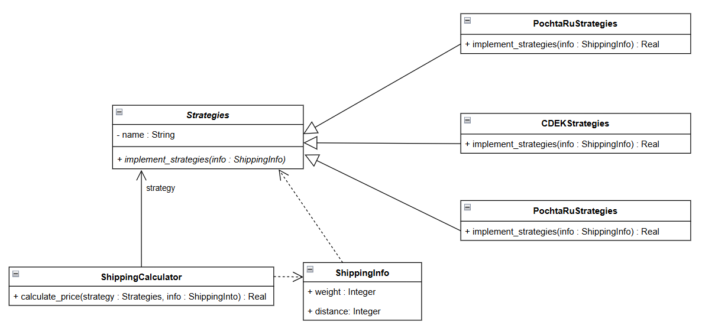
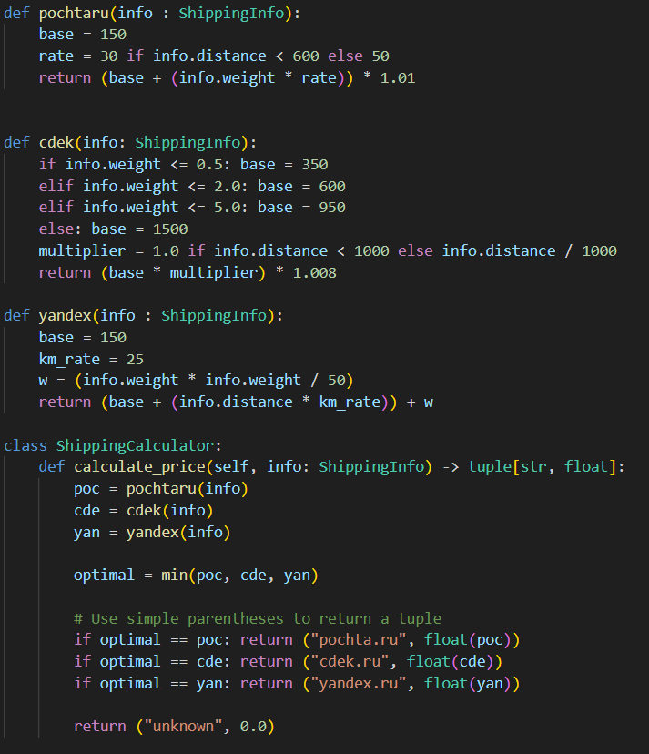

# Shippro

## __Задача__(Flyweight):
Существует три транспортные компании: CDEK, Yandex и Pochta, каждая из которых использует разные методы ценообразования в зависимости от расстояния и веса. Определите оптимальную транспортную компанию для заданного расстояния и веса груза.

## __Решение__:
Используя Strategy, мы создадим класс для каждой судоходной компании, содержащий cвой метод для расчета цены. Все три класса будут наследовать от абстрактного класса под названием Strategy. А класс ShippingCalcalator будет отвечать за расчет и выбор самой дешевой компании.

На рисунке 1 представлена диаграмма классов для описанного выше подхода. 

На рисунке 2 показан пример реализации кода, представленная на диаграмме на рисунке 1.

Без применения шаблона Strategy нам сначала пришлось бы определить каждую компанию с помощью функции. Затем нам пришлось бы добавить условия if... else... в класс ShippingCalculator и вычислить их. На рисунке 3 показан код, в котором шаблон Strategy не применяется.

### __Заключение__:
Стратегия отделяет ShippingCalculator от логики конкретных перевозчиков, что позволяет динамически переключаться между компаниями, такими как FedEx или UPS, во время выполнения. Такая архитектура способствует расширяемости, позволяя интегрировать новых поставщиков без изменения существующего кода. В результате система эффективно определяет оптимальный баланс между скоростью доставки и стоимостью.
# Ссылка на проект: 
    https://github.com/solovozer/-2
