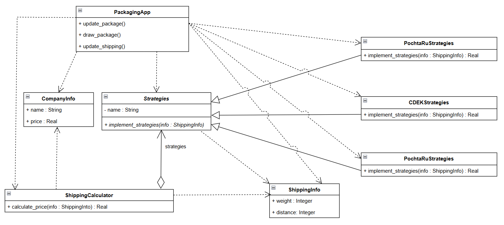
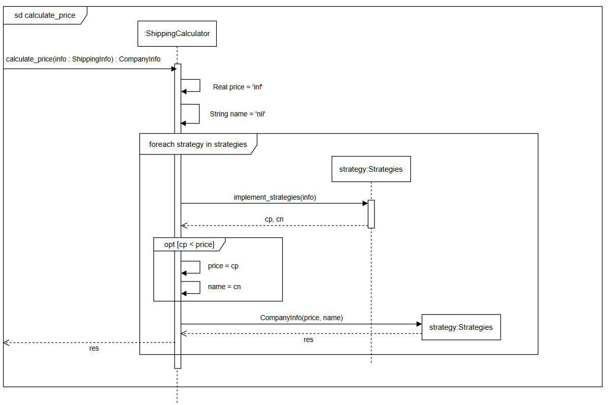
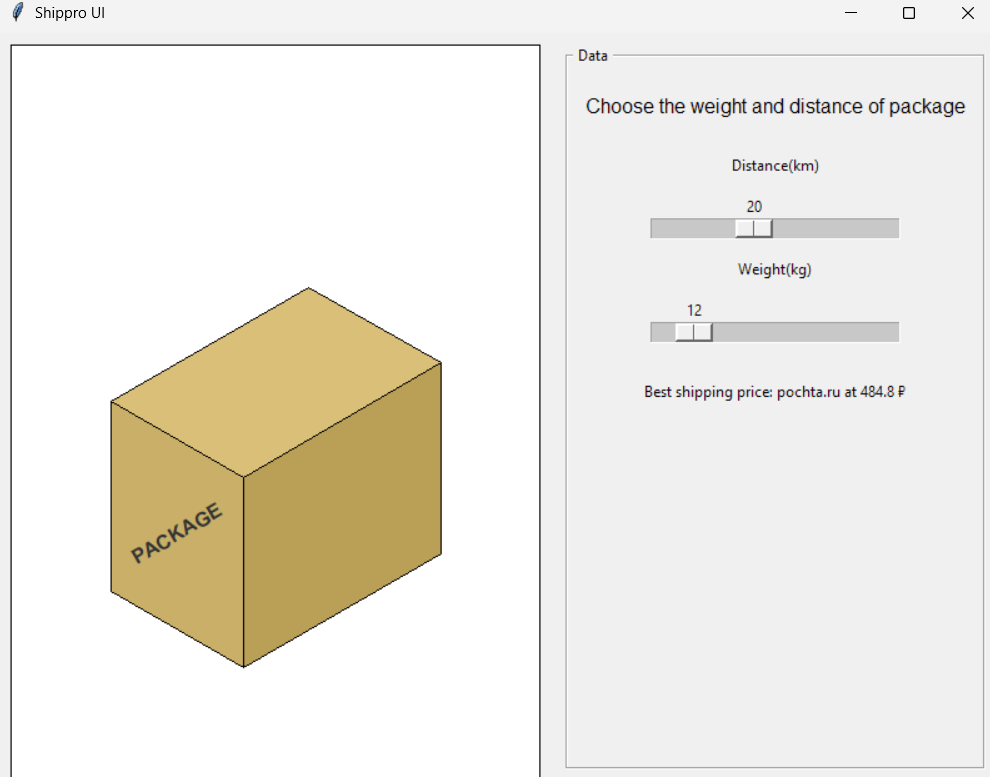

# Shippro

**Задача(Strategy):** Существует три транспортные компании: CDEK, Yandex и Pochta, каждая из которых использует разные методы ценообразования в зависимости от расстояния и веса. Определите оптимальную транспортную компанию для заданного расстояния и веса груза.

**Решение:** Используя Strategy, мы создадим класс для каждой судоходной компании, содержащий cвой метод для расчета цены. Все три класса будут наследовать от абстрактного класса под названием Strategy. 
</br>

Ниже представлена ​​диаграмма классов реализации.


</br>
А ниже фрагмент кода для классов

```python
class Strategies(ABC):
    def __init__(self, name): self.name = name
    @abstractmethod
    def implement_strategies(self, info: ShippingInfo): pass

class PochtaRuStrategies(Strategies):
    def __init__(self): super().__init__("Pochta.ru")
    def implement_strategies(self, info: ShippingInfo): #...

class CDEKStrategies(Strategies):
    def __init__(self): super().__init__("cdek.ru")
    def implement_strategies(self, info: ShippingInfo): #...

class YandexStrategies(Strategies):
    def __init__(self): super().__init__("Yandex.ru")
    def implement_strategies(self, info: ShippingInfo): #...
```
</br>


А класс ShippingCalculator, получающий на вход список стратегий, будет отвечать за тестирование каждой стратегии и выбор наиболее эффективной из них.

```python
class ShippingCalculator:
    def __init__(self, strategies: List[Strategies.Strategies]): 
        self._strategies = strategies

    def calculate_price(self, info: ShippingInfo):
        #...
        for strategy in self._strategies: #...
```
</br>
Этот класс приложения будет реализован при вызове функции calculate_price().

```python
strategies = [
    CDEKStrategies(),
    PochtaRuStrategies(),
    YandexStrategies(),
]
calculator = ShippingCalculator(strategies=strategies)
best = calculator.calculate_price()#...
```

</br>

На рисунке 2 представлена ​​диаграмма последовательностей для calculate_price().


</br>

## Без применения Strategy:
Нам сначала пришлось бы определить каждую компанию с помощью функции. Затем нам пришлось бы добавить условия if... else... в класс ShippingCalculator и вычислить их. На рисунке 3 показан код, в котором шаблон Strategy  не применяется.

```python

def pochtaru(info : ShippingInfo):#...
def cdek(info: ShippingInfo):#...
def yandex(info : ShippingInfo):#...
```
</br>
ShippingCalculator:

```python
class ShippingCalculator:
    def calculate_price(self, info: ShippingInfo):
        #...
        if optimal == poc: return CompanyInfo("pochta.ru", float(poc))
        if optimal == cde: return CompanyInfo("cdek.ru", float(cde))
        if optimal == yan: return CompanyInfo("yandex.ru", float(yan))
```

На рисунке 3 представлена GUI приложения


# Заключение

Паттерн Strategy преобразует ShippingCalculator из жесткого, монолитного скрипта в гибкий механизм выполнения. Разделение логики вычислений от класса калькулятора позволяет исключить уязвимые условные блоки. Такой подход соответствует принципу открытости/закрытости, позволяя подключать новых поставщиков услуг доставки во время выполнения, просто добавляя их в список стратегий. В конечном итоге, это обеспечивает модульную, тестируемую и масштабируемую архитектуру, которая обрабатывает сложные бизнес-правила с минимальным дублированием кода.

### Сравнение подходов: 
| Характеристика | Без Strategy (Hardcoded) | С использованием Strategy |
| :--- | :--- | :--- |
| **Принцип Open-Closed** | **Нарушен.** Нужно править класс `ShippingCalculator` при добавлении каждого нового перевозчика. | **Соблюден.** Новые перевозчики добавляются через создание новых классов без изменения старого кода. |
| **Поддерживаемость** | **Низкая.** Цепочки `if/elif` превращаются в «спагетти-код», который сложно читать и легко сломать. | **Высокая.** Логика каждого провайдера изолирована в своем классе, что делает систему модульной и чистой. |
| **Тестируемость** | **Сложная.** Нельзя протестировать логику одного перевозчика в изоляции от всего блока условий. | **Простая.** Каждая стратегия тестируется отдельно как независимый компонент. |
| **Масштабируемость** | **Статическая.** Метод `calculate_price` раздувается и становится неуправляемым при росте числа служб. | **Динамическая.** Калькулятор остается компактным: количество стратегий в списке не усложняет его код. |

---

Ссылка на проект:  [https://github.com/solovozer/-2](https://github.com/solovozer/-2)
