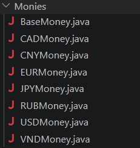
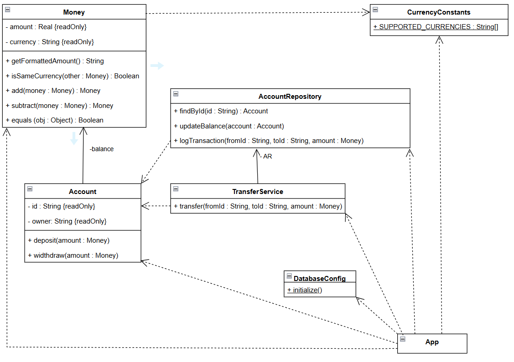

# Value Objects

**Задача(Value Objects):** Один банк предоставляет возможность открытия счетов в различных иностранных валютах и ​​осуществляет управление переводами между этими счетами. Необходимо обеспечить, чтобы переводы могли выполняться исключительно между счетами, открытыми в одной и той же иностранной валюте.
</br>

## Без применения Value Objects:
Каждый тип валюты будет храниться в соответствующем классе. Операции, выполняемые над валютой, будут непосредственно изменять денежное значение, хранящееся на счете. За создание соответствующего типа валюты будет отвечать класс `MoneyFactory`.

```java

public abstract class BaseMoney {
    private long amount; 
    //...

    public void add(BaseMoney other) {
        if (!this.getCurrency().equals(other.getCurrency())) {
            throw new IllegalArgumentException("Currency mismatch");
        }
        this.amount += other.getAmount();
    }

    public void subtract(BaseMoney other) {
        if (!this.getCurrency().equals(other.getCurrency())) {
            throw new IllegalArgumentException("Currency mismatch");
        }
        this.amount -= other.getAmount();
    }
}
```

И каждый класс, представляющий конкретный тип валюты, будет наследовать от базового типа валюты, при этом определённые компоненты будут модифицированы.
```java
public class CADMoney extends BaseMoney{
    public CADMoney(long amount) {
        super(amount);
    }

    @Override
    public String getCurrency() {
        return "CAD";
    } 
}
```

При использовании первого подхода любое изменение значения валюты влечет за собой изменение её значения во всех связанных классах. Любой класс обладает полномочиями хранить наследующий экземпляр конкретного класса `BaseMoney`, использовать его для создания счета (представляющего собой класс `Account`), а затем напрямую изменять значение внутри класса `BaseMoney`  — и всё это без ведома самого класса `Account` о произошедшем изменении.
</br>

Более того, использование паттерна Factory в данном случае представляется несколько избыточным, поскольку изменение набора поддерживаемых валют в классе `CurrencyConstants` влечет за собой необходимость внесения правок как в классы, содержащиеся в файле `Monies`, так и в класс `MoneyFactory`.



## С применением Value Objects:
Он состоит из единственного константного класса — Money. Этот класс хранит тип валюты и сумму — два атрибута, являющихся константами. Изменение значения подразумевает создание нового объекта с этим новым значением. Это гарантирует, что никакие два объекта не будут иметь один и тот же адрес в памяти.

```java
public final class Money {
    private final long amount;
    private final String currency;

    public Money(long amount, String currency) { //...
    }
    //...

    public Money add(Money amount) {
        if (!this.isSameCurrency(amount)) {
            throw new IllegalArgumentException("Currency mismatch!");
        }
        return new Money(this.getAmount() + amount.getAmount(), this.getCurrency());
    }

    public Money subtract(Money amount) {
        if (!this.isSameCurrency(amount)) {
            throw new IllegalArgumentException("Currency mismatch!");
        }
        return new Money(this.getAmount() - amount.getAmount(), this.getCurrency());
    }
}
```

Ниже представлена диаграмма классов применения Value Object


Этот подход обеспечивает инкапсуляцию в рамках ООП, одновременно решая проблему разрастания классов. Кроме того, сборщик мусора Java эффективно обрабатывает устаревшие объекты.

## Заключение
Использование Value Object и принципа immutability критически важно для финансовых систем. Это исключает побочные эффекты и «скрытые» изменения данных, обеспечивая потокобезопасность. Подход через композицию избавляет от разрастания классов и упрощает поддержку, а современная JVM эффективно оптимизирует создание короткоживущих объектов, гарантируя высокую производительность при максимальной надежности кода.


## Сравнение подходов

| Характеристика | Подход 1: Наследование и Мутабельность | Подход 2: Value Object (Immutability) |
| :--- | :--- | :--- |
| **Изменяемость** | **Mutable** (изменяет состояние текущего объекта) | **Immutable** (создает новый объект при операциях) |
| **Безопасность** | Риск побочных эффектов и "скрытых" изменений | Полная потокобезопасность и предсказуемость |
| **Архитектура** | Избыточность (нужен отдельный класс на валюту) | Лаконичность (один класс для всех валют) |
| **Расширяемость** | Сложно (нужно менять Factory и классы) | Легко (управление через константы данных) |
| **Целостность** | Ссылки на объект могут привести к багам | Объект-значение невозможно повредить |
| **Память** | Экономит объекты, но усложняет логику | Создает временные объекты (оптимально для GC) |


Ссылка на проект:  [https://github.com/solovozer/-2](https://github.com/solovozer/-2)
